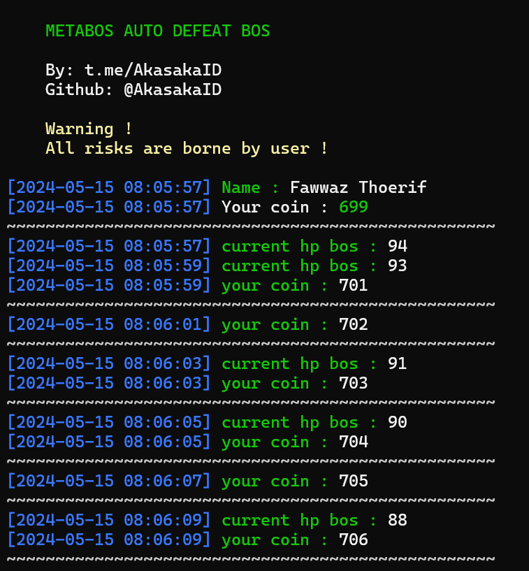

# Metabos

Auto defeat the bos



## README versi Inggris bisa dilihat [DISINI](README.md)

# Peringatan !

> Semua risiko ditanggung pengguna 

# Cara penggunaan

1. Start bot di telegram terlebih dahulu

    [https://t.me/metaboss_2024_bot?start=ref_629438076](https://t.me/metaboss_2024_bot?start=ref_629438076)

2. Pastikan di komputermu terinstall python dan git, jika belum silahkan menginstall terlebih dahulu

3. Clone the repository

    ```
    git clone https://github.com/AkasakaID/metabos.git
    ```
4. Masuk ke folder metabos

    ```
    cd metabos
    ```

5. Install library yang dibutuhkan

    ```
    pip install -r requirements.txt
    ```

6. Selanjutnya kamu harus mengisi file `data.json` untuk mengisinya kamu bisa melihat video panduan berikut :
   - Cara mengaktifkan dev tool di aplikasi telegram : [https://youtu.be/NYxHmck_GjE](https://youtu.be/NYxHmck_GjE)

   - Cara mendapatkan data metabos : [https://youtu.be/BK2J3gfs1Bk](https://youtu.be/BK2J3gfs1Bk)

# Discussion

Jika kamu memiliki pertanyaan, silahkan bertanya digrup chat : [https://t.me/sdsproject_cha](https://sdsproject_chat)

# Support

Kamu bisa membelikanku kopi melalui link dibawah

[https://trakteer.id/fawwazthoerif/tip](https://trakteer.id/fawwazthoerif/tip)

[https://sociabuzz.com/fawwazthoerif/tribe](https://sociabuzz.com/fawwazthoerif/tribe)

# Terima kasih <3